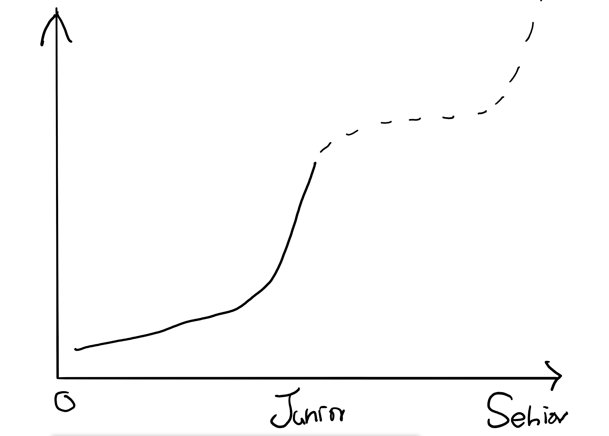

## 六到十週心得與解題心得

## 第六週（07/20 ~ 07/26）：前端基礎 HTML 與 CSS

 
<ul>
<li>P1 你知道 HTML 是在做什麼的
</li><li>P1 你知道如何使用有語意的（semantic）標籤
</li><li>P1 你知道基本 SEO 的概念
</li><li>P1 你知道 CSS 是什麼
</li><li>P1 你知道 inline、block 跟 inline-block 的區別
</li><li>P1 你知道什麼是 box model
</li><li>P1 你知道 position 的所有屬性及其差別
</li><li>P2 你知道 :hover, :before, :after
</li><li>P2 你知道 :nth-child 的各種用法
<li>P2 你熟悉 CSS selector，可以輕鬆選到想選到的元素
</li>
</ul>

這週應該是最為擅長的一週了，切版對自己來說不算什麼大問題。

但是在這週的收穫其實也不少嘿嘿，在這週多吸收了了一些關於 selector 的內容，還有對於 flex 的掌握度也更高了。

至於對自己而言是 css 神技的 grid...稍微比較敢用了，之前一直覺得的 grid 很之複雜，重新玩一次 [grid garden](https://cssgridgarden.com/) 之後稍微好一點了，簡單來說就是先切格子，再分配格子。不過我覺得 grid 真正神的地方再 auto-fit, auto-fill 還有 minmax 等等的操作，這個就...之後總有一天在征服他們。

### 在這週得到什麼？
- grid 正式入門
- flex 熟悉
- css 的 Selector，尤其是 `~` 還有 `+` 這兩個之前幾乎沒用過
- margin collapse，自己覺得這個還蠻重要的，以前遇到這件事情都歸類在靈異事件

其實關於 css 的收穫還有很多，不過自己每次看 CSS 幾乎都是有甚麼需要才去找相關內容來查，CSS 的大觀念自己覺得比較沒有那麼複雜：box model, CSS selector，還有 position, display: block/inline-block 這些東西。

有些人會在進度報告上面問說切版的問題，這就很像騎腳踏車，每個人都會有一套自己的方法，切久了就知道了，不過如果真的這樣講可能就真的太沒有同理心了XD。但是如果真的要分享經驗的話，可能又會像這樣：先大部分切出來，然後再切細部。但是甚麼是大部分，什麼是細部，真的很難去清楚的詮釋去分類這種東西。

關於切版的建議真的都很像心法，可能聽過之後就慢慢從做中體會吧（？。不過我記得我一開始最困惑的東西是 display 要用哪個，還有 position，這兩個在課程中提的算是蠻清楚的。

## 第七週（07/27 ~ 08/02）：前端基礎 JavaScript

#### 自我檢測

 
<ul>
<li> P1 你知道 JavaScript 跑在網頁上跟跑在 Node.js 上差在哪裡</li>
<li> P1 你知道 DOM 是什麼</li>
<li> P1 你知道如何用 JavaScript 操控 DOM 物件</li>
<li> P1 你知道如何幫一個按鈕加上 event listener</li>
<li> P1 你知道捕獲與冒泡是什麼</li>
<li> P1 你知道什麼是事件代理（delegation）</li>
<li> P2 你知道怎麼用 JavaScript 更改元素的 style</li>
<li> P2 你知道 preventDefault 與 stopPropagation 的差異</li>
</ul>

### 在這週得到甚麼？
- 事件的捕獲 & 冒泡,  stopPropagation, 以及事件代理

之前還有點天真的想說 DOM 就是只是選選元素改改 innetText 或者是 class 什麼的而已，這週就補充了關於 bubbling 跟 capture 的差異以及 stopPropagation 這個重要的觀念。

## 第八週（08/03 ~ 08/09）：前端基礎串 API

<ul>
<li>P1 你知道什麼是 API</li>
<li>P1 你知道什麼是 Ajax</li>
<li>P1 你知道從網頁前端呼叫 API 與在自己電腦上寫程式呼叫的差異</li>
<li>P1 你知道什麼是同源政策（Same-origin policy）</li>
<li>P1 你知道如何存取跨網域的資源（CORS）</li>
<li>P1 你知道什麼是 JSON</li>
<li>P2 你知道什麼是 JSONP 及其原理</li>
</ul>

這週算是之前不太熟的一塊，曾經去面試實習的時候被問到說，你有用過 API 嗎？我當時就一個愣住了，其實自己之前是有使用原生地 fetch 或者是 axios 等等的東西去拿一些別人給的東西，對於所謂 API 是甚麼並沒有很全面性的了解。

自己覺得在網路上關於了解 API 的資源比較零碎（或者可能自己沒找到完整的資源），API 這個概念自己覺得並不是很複雜，但是意思上比較廣泛、籠統的名詞，網路上文章介紹的比較片面，大部分的內容都是直接告訴你說要怎麼用各種方式去串接別人給的 API 或者在提一些 Restful API 的東西（可能是 104 上面很夯？）。

尤其是在提及串接 API 的文章，可能會教你用 fetch 串一些東西、當你看到另一篇文章交的確是用 XMLhttprequest，或者是其他 package，一開始在學的時候沒辦法體會這是一樣的一個東西，大部分的教學只會提到串 API 的方法而比較少提到 API 的本質，或者更精確來說是 Web API 的本質：Http request method。

但在 mentor program 裡面則是一開始就用很原始的方法去解釋了這塊。從最原始、最根本的東西開始講起我覺得是理解一件事情的好方法，這樣可以理解整個技術演進的脈絡還有過程，這個也是自己在這前幾周的課程中所感受到的東西。前面如果能懂那在這週就比較可以理解，就是把在 termanal 執行的東西搬到 browser 上，理解起來會簡單許多。

## 第九週（08/10 ~ 08/16）：後端基礎 PHP 與 MySQL

<ul>
<li> P1 你知道 PHP 是什麼</li>
<li> P1 你知道前端與後端的差別</li>
<li> P1 你知道什麼是資料庫</li>
<li> P1 你了解基本的 SQL 語法，包括 Select、Insert Into、Delete 與 Update</li>
<li> P1 你能夠寫出基本的 CRUD 應用</li>
<li> P1 你知道什麼是 Session</li>
<li> P1 你知道什麼是 Cookie</li>
<li> P1 你知道 Session 與 Cookie 的差別</li>
</ul>

第一次接觸 PHP 也是第一次接觸後端，原本覺得後端應該會超級難，不過這週比想像中的還要親民，而且還挺意外的，可能是很久沒有學新的語言，竟然自己真的可以在短短的幾天內學一個新的語言然後真的做出一些東西，真的是很大程度的增進了信心。這週的內容比起 SQL 來說，PHP 的部分困擾我很多，有很多地方的設計和 JS不太一樣，用 JS 的邏輯下去寫常常四處碰壁，做完作業之後好懷念 JS 的奔放還有自由，恨不得趕快投入 Express.js 的懷抱~~逃避 PHP~~。 

另外真的很慶幸在大四的最後上了一個學期的資料庫（雖然對於文組科系的我真的是啃得很累），對於關聯式資料庫有稍微多一點的理解，在用 myPHPadmin 的時候看到很多很熟悉的名詞呢，但是對 SQL 語法還是很不熟就是了，到現在 UPDATE 還是要查了才會用 XD。

這週還有講到 session 跟 cookie 這兩個東西，尤其是 session 這個東西真的是超抽象的，跟前面的 API 一樣解釋起來又很籠統，而且 session 這個概念也不只有在前後端之間會用到， OSI 七層也有一層叫做 session layer，不過在概念上應該是相似的。其實這個詞如果英文是母語的人應該會理解得比較快吧，中文好像沒有一個很確切的詞語可以對到這個概念，所以逮完郎理解起來就相較之下吃力很多。

## MurMur

這段自己也不知道在打啥，回過頭來就變這樣了

---

就像 Huli 提到的，這前十週上完之後就可以說自己是一個會 "會寫網頁的人" 了，因為基本上已經可以自己依照自己的想像，架設一個網頁並放依些東西上去。自己之前很忽略後端的部分，不會後端最明顯的問題就是 side project 做不出來，因為很多內容是需要靠 database 拿資料或者跟後端互動，但如果這些東西不會的話真的就只能一直練習刻版面（雖然可以用 firebase 先擋一擋），但是我認為懂後端這是必須的，忘記在哪篇文章提到，前端工程師是比較熟悉前端的網頁工程師（原話大概是這樣吧，忘記內容了），所以在做為一位前端工程師之前，更要是一位網頁工程師，既然是網頁工程師，那就沒有前端跟後端的差別，這都是需要會的部分，而且懂後端之後，前端才會開始好玩起來啊 XD，可以開始實現腦袋想的東西。

---

自己以一個"過去學術不精"的前端開發者，而且"不用上正職"的學員的角度來看這個課程，這前十週的課程壓力是還好的，不過這也是理所當然，時間與對前端的了解本來就比別人多一些，有餘裕也是理所當然的。在課程的緊湊度在個人主觀角度覺得算是合理的，尤其是看到第二期計畫的課綱再比較這次的課綱覺得大概會有一種高鐵比區間車的感覺。

---

有時候會這樣想，想踏入前端這個領域的人多，還是像我一樣"半吊子"的人多？其實依現在網頁工程師的產業需求來看，在前端即使很多比較基礎東西不會也可以獲得一份相較於其他產業來說可觀的薪水，當然有很多人也會想要打好基礎然後飛到更高更遠的地方就是。也因為這樣會思考說：對現在台灣的前端生態來講， fresh => junior 這段是不是有不小的需求。前端入門比起其他工程師相對容易，但是在前端要成為 Senior 一定是不簡單的，太多人突然就撞進前端，但是也僅止於此，可能也因為這樣所以前端會在鄙視鍊的最底端吧(?)。

不過我也沒有甚麼實際的觀察，只是一個沒上過班的蔡逼八的空想。

---

自己學習前端一段時間，我自己覺得前端的學習曲線大概是這樣的：

每次要升一個程度上去總會遇到一個坎（junior 之後我也不知道，離自己還有一段距離）。回想起學前端的經驗，一開始接觸 HTML, CSS 還有一些簡單的 JS DOM 操作，到稍微熟練的時候都覺得自己是不是已經年薪百萬了，莫非我是萬中無一的天才吧，看來再努力一下就可以再做出一個 facebook 然後進 google 上班了。後來接觸到一些更深的 JS，還有框架等等比較抽象的東西，稍微了解一下就腦袋爆炸直接被打趴然後進入挫折期 XD。

## 屁話後的結語

自己異世界更新後目前破到第 13 關，14 關暴力解一直出現 `roblem with request: connect ETIMEDOUT 34.197.151.45:443`，感覺可能是短時間送 request 被 server 擋掉了，再想想要怎麼處理好了。

綜合能力測驗則是最後一關暴力破掉了，自從異世界的第十關用暴力的方式破掉之後就好像吃了無敵星星一樣，這種要試看看的東西都無視提示直接暴力破下去 XD

打到這裡才發現廢話真的很多，這幾週還是蠻感謝 Huli 還有助教的，每次交作業都會超怕有沒有甚麼 bug 或者有 console.log 忘記刪，可能跟面試差不多緊張。問問題的時候也是挺緊張的，很怕說是不是問蠢問題或者是 google 就可以解決，而且也怕說占用到時間。但是也因為這樣會找的更用力一點 XD，比較不會發生「喔算了，改天再看吧，反正之後會遇到」，這種放過自己的情形，也算是不錯的結果~~因禍得福~~。

Big Guy is John，感謝 Huli 助教以及參與課程的各位～